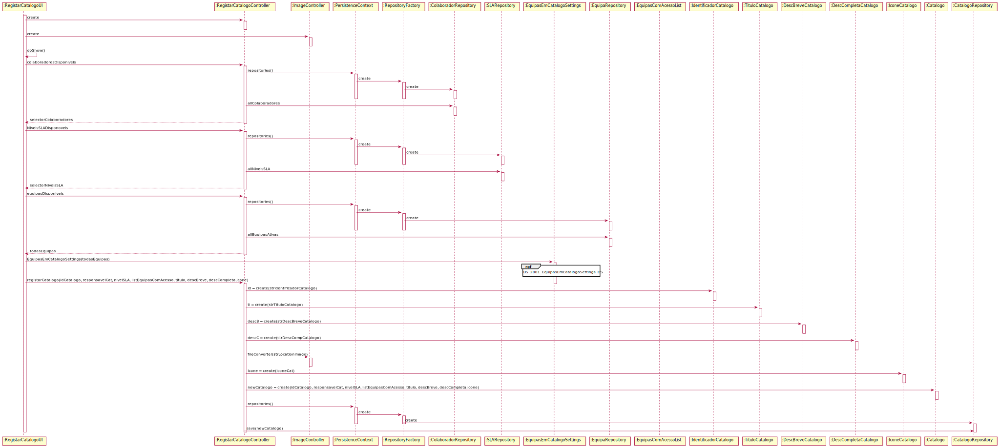

# US_2001

# 1. Análise

A interpretação feita deste requisito foi no sentido de clarificar o que é pretendido pelo Gestor de Serviços de Help Desk (ator principal), que está responsável pela criação de um catálogo.

#### Requisitos funcionais

O sistema deve permitir o registo de um novo catálogo, através do preenchimento e seleção dos diversos campos necessários ao Gestor de Serviços de Help Desk. Assim como permitir que não conclua o seu preenchimento para o finalizar mais tarde. Todos os códigos/identificadores que são alfa-numéricos devem ser case-insensitive.

#### Regras de negócio

* Apenas o Gestor de Serviços de Help desk (GSH) consegue registar um catálogo ao sistema.
* Descrição breve presente no catálogo deve ter um limite máximo de 40 caracteres;
* Descrição completa presente no catálogo deve ter um limite máximo de 100 caracteres;
* O Gestor de Serviços de Help Desk pode não especificar todos os campos, finando o catálogo ainda indisponível, pondendo este ser concluído mais tarde.

#### Partes interessadas

As partes interessadas nesta US são o colaborador que fica responsável pelo catálogo, e os colaboradores pertencentes as equipas que ficam com acesso ao catálogo em questão.

#### Pré-condições

* Existir colaboradores presentes no sistema para podermos indicar um colaborador responsável pelo catálogo em questão.
* Existir níveis de criticidade no sistema para se identificar o pretendido para o catálogo.
* Existir equipas presentes no sistema para atribuir critérios de acesso a determinadas equipas.
* Haver colaboradores associados a equipas para posteriormente acederem aos catálogos que têm acesso.

#### Pós-condições

* Registar o catálogo no sistema.
* Garantir o acesso aos colaboradores específicos.

#### Fluxo

O Gestor de Serviços de Help desk (GSH), inicia a criação de um novo catálogo de serviços. Insere o identificador de catálogo, de seguida indica o colaborador que fica responsável pelo catálogo em questão. Indica o nível de criticidade associado ao mesmo e associa que equipas vão ter critérios de acesso a este catálogo. Passámos ao registo de catálogo no sistema onde adicionamos o título do catálogo, uma descrição breve, outra detalhada e a localização do ícone desejado, tudo respeitando as regras de negócio confirmadas com o cliente, levando à criação do catálogo desejado, havendo finalmente persistência dos dados para a base de dados.

# 2. Design

Procedemos a alteração do Modelo de Domínio devido a esta US, inicialmente o modelo de domínio tinha uma entidade denominada "CriterioAcesso" que seria responsável por agregar todas as equipas que teriam acesso a um determinado catálogo. Inicialmente esta entidade estava presente num agregado dele mesmo, porém com uma análise mais aprofundada vemos que faz sentido estar no agregado de catálogo uma vez que vai ser um "value object" de catálogo que permitirá que não existam ligações de muitos catálogos para muitas equipas, para além disso alteramos o nome para "EquipasComAcessoCatalogo" por ser um nome mais sugestivo.

## 2.1. Realização da Funcionalidade

Para registar um catálogo:
	Classes de domínio: IdentificadorCatalogo, EquipasComAcessoCatalogo, TituloCatalogo, DescBreveCatalogo, DescCompletaCatalogo, IconeCatalogo, Catalogo;
	Classes de aplicação: ListCatalogoService, ListCatalogoController, ImageController, RegistarCatalogoController;
	classe repositorio: CatalogoRepository;

## 2.2. Diagrama de Sequência

## 2.3. Padrões Aplicados

* Padrão GRASP na criação de controladores para atribui a responsabilidade de manipular eventos do sistema para uma classe que não seja de interface do usuário (UI);

## 2.4. Testes

**Teste Modelo:** Verificar que não é possível criar um identificador de Catalogo sem cumprir as regras de negócio determinadas pelo cliente.

    @Test(expected = IllegalArgumentException.class)
    public void testCreationErrorNullId() {
        System.out.println("Id creation");
        IdentificadorCatalogo instance1 = new IdentificadorCatalogo("");
        assertTrue(true);
    }

    @Test(expected = IllegalArgumentException.class)
    public void testCreationErrorTwoWordsId() {
        System.out.println("Id creation");
        IdentificadorCatalogo instance2 = new IdentificadorCatalogo("Duas Palavras");
        assertTrue(true);
    }

    @Test(expected = IllegalArgumentException.class)
    public void testCreationMaxLeghtId() {
        System.out.println("Id creation");
        IdentificadorCatalogo instance3 = new IdentificadorCatalogo("1234567");
        assertTrue(true);
    }

    @Test
    public void testCreationId() {
        System.out.println("Id creation");
        IdentificadorCatalogo instance = new IdentificadorCatalogo("Cat1");
        assertTrue(true);
    }

# 3. Integração/Demonstração

O principal objetivo deste caso de uso seria registar catalogos no sistema. Para tal, para além de um registo simples de uma entidade na memória, foi necessário garantir que existiam equipas para serem selecionadas como autenticadores de acesso a catálogos, o mesmo como colaboradores para se escolher o responsável de catálogo e níveis de criticidade para este ter objetivos para cumprir no futuro. Portante, utilizando classes pre-existentes na template/framework, registou-se um catalogo.

# 4. Observações

Futuramente deseja-se a implementação de DTO's para salvaguardar melhor as entidades na interação entre a UI e o Dominio. 
