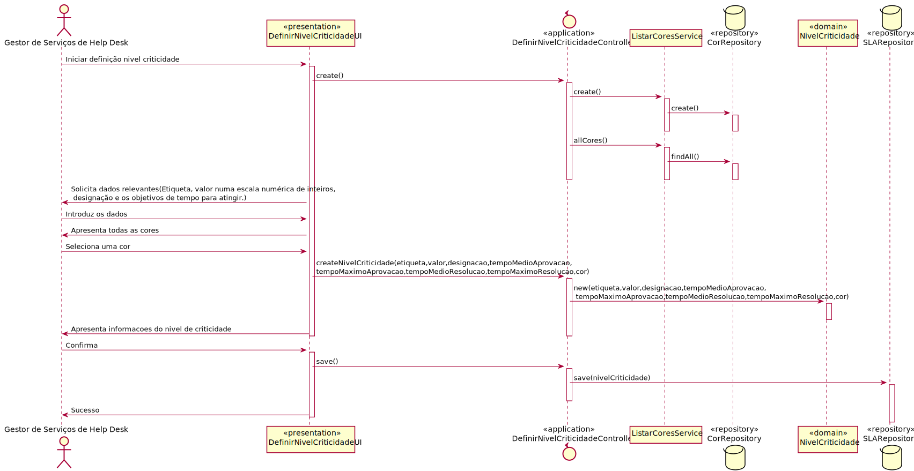
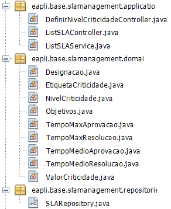

# US_2010 

# 1. Análise

#### Requisitos funcionais

O sistema deve permitir o GSH criar niveis de criticidade para futuramente aplicar a organizações.

#### Regras de negócio

* Um nível de criticidade caracterizase por uma etiqueta (e.g. baixa, média, elevada), um valor numa escala numérica de inteiros, uma cor indicativa de gravidade e respetivos objetivos;
* Tempos são indicados em minutos;
* Normalmente a etiqueta é uma ou duas palavras, portanto, 25 caracteres devem ser suficientes.

#### Partes interessadas

As partes interessadas nesta US são o GSH que pretende definir os niveis de criticidade e futuramente atribuir estes a catalogos ou servicos.

#### Pré-condições

* Apenas o GSH consegue definir os niveis de criticidade.
* Existir cores no sistema para identificar os niveis de criticidade.

#### Pós-condições

* Um nivel de criticidade fica definido no sistema.

#### Fluxo

O Gestor de Serviços de Help Desk (GSH) inicia a definição de um nivel de criticidade. O sistema solicita os dados relevantes (Etiqueta, valor numa escala numérica de inteiros, designação e os objetivos de tempo para atingir). O GSH introduz os dados. O sistema pede-lhe para selecionar uma cor. O GSH seleciona uma cor. O sistema apresenta os dados e confirma. O GSH confirma e o nivel de criticidade é guardado no sistema. 

#  Design

##  Realização da Funcionalidade
Para definir um nivel de criticidade: Classes de dominio: NivelCriticidade, Objetivos, EtiquetaCriticidade,ValorCriticidade,Designacao,Cor,TempoMaxAProvacao,TempoMaxResolucao,TempoMedioAprovacao,TempoMedioResolucao; Classes de aplicação: ListCorService, DefinirNivelCrticidadeController; classe repositorio: SLARepository

## Diagrama de Sequência

##  Padrões Aplicados
Padrão GRASP na criação de controladores para atribui a responsabilidade de manipular eventos do sistema para uma classe que não seja de interface do usuário (UI);

##  Testes

**Teste 1:** Verificar que não é possível criar uma instância da classe NivelCriticidade com Objetivos nulos.

	@Test(expected = IllegalArgumentException.class)
		public void ensureNullIsNotAllowed() {
		 NivelCriticidade instance = new NivelCriticidade(null, new Designacao(), new EtiquetaCriticidade(), new ValorCriticidade(), new Cor());
        assertTrue(true);
	}
**Teste 2:** Verificar que não é possível criar uma instância da classe TempoMedioResolucao com valores de tempo negativos.

    @Test(expected = IllegalArgumentException.class)
    public void testEnsureTempoMedioResolucaoIsNotNegative() {
        TempoMedioResolucao instance = new TempoMedioResolucao(-1);
        assertTrue(true);
    }
    
**Teste 3:** Verificar que não é possível criar uma instância da classe Objetivos com tempo de resolucao medio superior ao tempo maximo.

    @Test(expected = IllegalArgumentException.class)
    public void testEnsureTempoMedioResolucaoNotGreaterThanTempoMaxResolucao() {
        Objetivos instance = new Objetivos(1,1,1,2);
        assertTrue(true);
    }
    

**Teste 4, 5 e 6:** Verificar que não é possivel criar uma instancia de Etiqueta de criticidade com input vazio, nulo ou superior ao limite de carateres

    @Test(expected = IllegalArgumentException.class)
    public void testEnsureEtiquetaCriticidadeNotNull() {
        EtiquetaCriticidade instance = new EtiquetaCriticidade(null);
        assertTrue(true);
    }

    @Test(expected = IllegalArgumentException.class)
    public void testEnsureEtiquetaCriticidadeNotEmpty() {
        EtiquetaCriticidade instance = new EtiquetaCriticidade("");
        assertTrue(true);
    }
    
    @Test(expected = IllegalArgumentException.class)
    public void testEnsureEtiquetaCriticidadeNotOverCharLimit() {
        EtiquetaCriticidade instance = new EtiquetaCriticidade("This string has 31 characters..");
        assertTrue(true);
    }
# Implementação

Amostra das classes de dominio associadas a este caso de uso:

# Integração/Demonstração

O objetivo deste caso de uso seria permitir a definicição de niveis de criticidade pelo Gestor de Servicos helpdesk. 

# Observações

No futuro será necessario atribuir o nivel de criticidade a um catalogo ou servico. Poderá ser incluido no final deste caso de uso uma opção para atribuir o nivel de criticidade criado a um catalogo/servico no final de sua criação.
