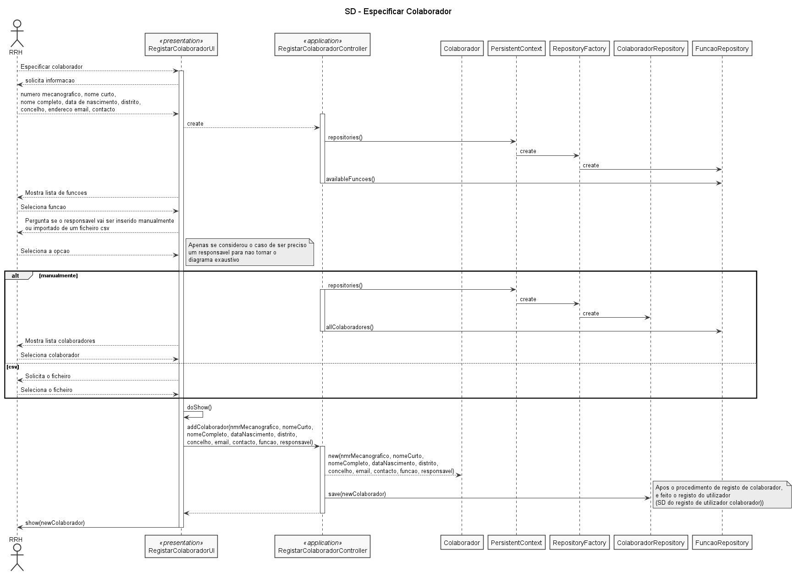
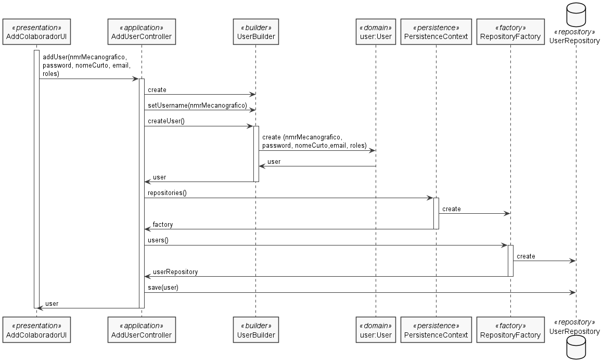
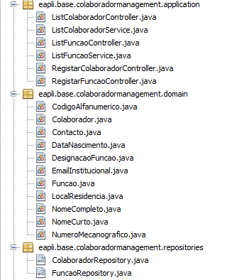

# US_2051
=======================================
# 1. Requisitos

**US_2051** Como Responsável de Recursos Humanos pretendo especificar um novo colaborador de modo a que este possa aceder e usar o sistema.

#### Requisitos funcionais

O sistema deve permitir a especificação de um novo colaborador, através do preenchimentos dos diversos campos necessários, recorrendo a um formulário de criação de novos colaboradores, disponível no menu de ações de um responsável de recursos humanos.

#### Regras de negócio

* Apenas o responsável de recursos humanos consegue adicionar colaboradores ao sistema.
* O responsável de recursos humanos está encarregue de definir o responsável de um colaborador (caso necessário).
* O nome completo do colaborador não pode exceder 80 caracteres (especificado pelo cliente fora do contexto do enunciado).
* O nome curto do colaborador corresponde ao primeiro e último nome do cliente (especificado pelo cliente fora do contexto do enunciado).

#### Pré-condições

* O sistema já ter todas as funções necessárias à especificação do colaborador.
* No caso do colaborador possuir um responsável hierárquico, é preciso que este esteja registado no sistema (é preciso ter em conta também a possibilidade de ser atribuído um responsável não só manualmente, mas também através de um ficheiro de texto).

#### Pós-condições

* A password de acesso ao sistema será enviada através de um email, ao colaborador recentemente adicionado (no contexto atual do projeto não é necessário despender tempo desnecessário em processos de autenticação/autorização de utilizadores, por isso a password não é enviada por email).
* O colaborador é registado no sistema como utilizador e como colaborador da organização.

#### Fluxo

O Responsável de Recursos Humanos inicia a especificação de um colaborador. O sistema solicita o número mecanográfico, nome curto, nome completo, data de nascimento, local de residência (i.e distrito e concelho), endereço de email institucional, número de contacto (telemóvel ou telefone). Seleciona também qual a função que desempenha (através da seleção de um conjunto de funções já registado no sistema). Caso seja necessário haver a especificação do responsável hierárquico do colaborador, o sistema permite a inserção manual (através da seleção de uma lista de colaboradores ou pesquisa de nome/email) ou importada através de um ficheiro de texto (não aplicável ao Sprint atual). O sistema valida, regista os dados, e procede ao registo de um novo utilizador, recorrendo ao endereço de email institucional, e a password é posteriormente enviada por email.

# Design

Para registar um colaborador:
	Classes de domínio: Colaborador
	Controlador: RegistarColaboradorController
	Repository: ColaboradorRepository, FuncaoRepository

Para regitar um colaborador como utilizador do sistema:
	Classes de domínio: User
	Controlador: AddUserController
	Repository: UserRepository

Diagramas de sequência:

As ligações para listagem de objetos foi ignorada por não ser relevante ao diagrama, destaca-se que no caso desta US, foi usado um controlador ListColaboradorController e um service ListColaboradorService, para listagem de possíveis colaboradores responsáveis. Conclusão, o ListColaboradorService está encarregue de "pedir" ao repositório dos colaboradores por todos os colaboradores disponíveis.

Para registar um colaborador:

Para registar um colaborador como utilizador (baseado no diagrama de sequência do exemplo de AddUser do repositório eCafetaria, como responsável o professor Paulo Sousa):

## Testes

**Teste 1:** Verificar que não é possível criar um colaborador com email null (aplicável aos outros atributos da entidade)

		@Test (expected = IllegalArgumentException.class)
			public void ensureColaboradorWithoutEmail() throws ParseException {
					new Colaborador(COLAB_NUM_MECANOGRAFICO, FUNCAO_TYPE, COLAB_NAME, COLAB_FULLNAME,
									getMainDate(), COLAB_MORADA, null, COLAB_CONTACTO, dummyColaborador());
			}

**Teste 2:** Verificar que é possível criar um colaborador com um email válido (aplicável aos outros atributos da entidade)

		@Test (expected = IllegalArgumentException.class)
		    public void ensureEmailNotNull() throws ParseException {
		        new Colaborador(COLAB_NUM_MECANOGRAFICO, FUNCAO_TYPE, COLAB_NAME, COLAB_FULLNAME,
		                getMainDate(), COLAB_MORADA, null, COLAB_CONTACTO, dummyColaborador());
		    }

**Teste 3 e 4:** Verificar que é possível criar um colaborador com um responsável e sem um responsável, respetivamente

		@Test
		    public void ensureColaboradorWithoutReponsavel() throws ParseException {

		        DataNascimento data = new DataNascimento(new SimpleDateFormat("dd/MM/yyyy").parse("12/07/2000"));
		        new Colaborador(COLAB_NUM_MECANOGRAFICO, FUNCAO_TYPE, COLAB_NAME, COLAB_FULLNAME,
		                data, COLAB_MORADA, COLAB_EMAIL, COLAB_CONTACTO, null);
		        assertTrue(true);
		    }

		@Test
    public void ensureColaboradorWithReponsavel() throws ParseException {

        DataNascimento data = new DataNascimento(new SimpleDateFormat("dd/MM/yyyy").parse("12/07/2000"));
        new Colaborador(COLAB_NUM_MECANOGRAFICO, FUNCAO_TYPE, COLAB_NAME, COLAB_FULLNAME,
                data, COLAB_MORADA, COLAB_EMAIL, COLAB_CONTACTO, dummyColaborador());
        assertTrue(true);
    }

# Implementação

Amostra das classes de domínio para evidenciar o uso dos necessários atributos(value objects) e das classes representadas no design do caso de uso.

# Integração/Demonstração

O principal objetivo deste caso de uso seria tornar uma pessoa não pertencente ao sistema, um colaborador, mas também um utilizador do sistema. Para tal, para além de um registo simples de uma entidade na memória, foi necessário garantir que este teria as credências/autorização necessária para poder entrar no sistema, nomeadamente na aplicação de utilizador (base.user.console). Portante, utilizando classes pre-existentes na template/framework (SystemUser e interação direta com o controlador e repositório de utilziadores), registou-se um colaborador como utilizador.

# Observações

No futuro, será necessário adicionar colaboradores responsáveis através de um ficheiro de texto (csv).
