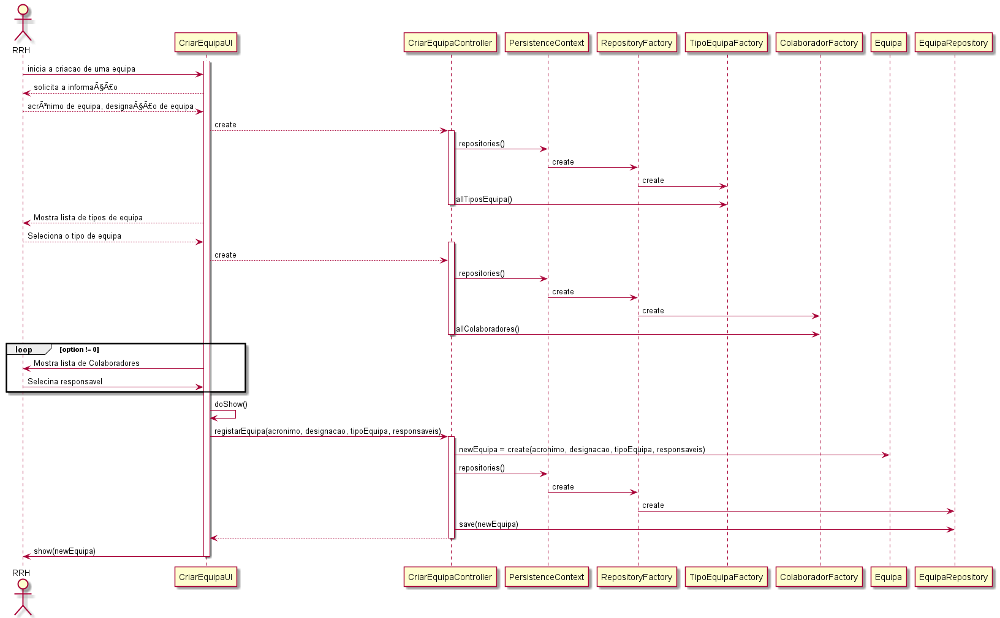
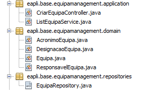

# US_2052
=======================================
# 1. Requisitos

**US_2052** Como Responsável de Recursos Humanos, eu pretendo criar uma equipa.

#### Requisitos funcionais

O Sistema deve permitir a criação de uma nova equipa, através do preenchimento de campos como o acrónimo único e a designação. Depois, tem que ser necessário selecionar um tipo de equipa a que pertence e um/vários resposáveis (colaboradores).

#### Regras de negócio

* O acrónimo da equipa tem que ter no máximo 10 caracteres.
* O Responsável de Recursos Humanos está encarregue de especificar a equipa.
* O acrónimo da equipa apesar de não ser o identificador da entidade (código único), tem que ser único.
* A equipa tem que ter obrigatoriamente, pelo menos, um responsável (colaborador).
* Uma equipa só pode pertencer a um tipo de equipa, mas um tipo de equipa pode ter várias equipas.

#### Pré-condições

* Deve haver tipos de equipa armazenados no sistema (bootstrap).
* Deve haver colaboradores armazenados no sistema (bootstrap) para que seja possível atribuir um responsável.

#### Pós-condições

* A equipa fica registada no sistema, com um tipo de equipa associado.
* Futuramente, os responsáveis das equipas vão poder aceder a informações privilegiadas da equipa.

#### Fluxo

O Responsável de Recursos Humanos inicia a criação de uma equipa. O sistema solicita um acrónimo, a seleção de um tipo de equipa, uma designação e a seleção de um ou mais colaboradores para tornar responsáveis. O Responsável de Recursos Humanos insere a informação. O sistema valida os dados e regista, informando o Responsável de Recursos Humanos do sucesso da operação.

# Design

Para registar uma equipa:
	Classes de domínio: Equipa
	Controlador: CriarEquipaController
	Repository: EquipaRepository

Para aceder a tipos de equipa:
  Repository: TipoEquipaRepository (recorrendo a ListTipoEquipaController que não está representado no diagrama. O controlador faz a ligação entre o repositório e a equipa)

Para aceder a colaboradores:
  Repository: ColaboradorRepository (recorrendo a ListColaboradorController que não está representado no diagrama. O controlador faz a ligação entre o repositório e a equipa)

Diagrama de sequência:

## Testes

**Teste 1:** Verificar que não é possível criar uma equipa com descrição null (aplicável aos outros atributos da entidade)

		@Test (expected = IllegalArgumentException.class)
		public void ensureCriarEquipaWithoutAcronimoEquipa() throws ParseException {
				fillResponsaveis();
				new Equipa(null, DESIGNACAO_EQUIPA);

				assertTrue(true);
		}

**Teste 2:** Verificar que é possível criar uma equipa com descrição válida (aplicável aos outros atributos da entidade)

		@Test
		public void ensureCriarEquipaWithDesignacaoEquipa() throws ParseException {
				fillResponsaveis();
				new Equipa(ACRONIMO_EQUIPA, DESIGNACAO_EQUIPA);

				assertTrue(true);
		}

**Teste 3 e 4:** Verificar que é possível adicionar um colaborar responsável à equipa, e que não é possível adicionar um colaborador inválido, respetivamente:

		@Test
		public void addCorrectResponsavelTest() throws ParseException {

				Set<Colaborador> colaboradores = new HashSet<>();
				colaboradores.add(dummyColaborador());
				colaboradores.add(dummyColaborador2());

				dummyEquipa.copyColaboradores(colaboradores);

				assertNotEquals(dummyEquipa.ResponsaveisEquipa(), null);
		}

		@Test (expected = IllegalArgumentException.class)
		public void addIncorrectResponsavelTest() {
				dummyEquipa.copyColaboradores(null);

				assertTrue(true);
		}

**Teste 5 e 6:** Verificar que é possível adicionar uma designação da equipa com menos de 10 caracteres, e que é impossível criar uma designação com mais de 10 caracteres, respetivamente.

		@Test
		    public void ensureCriarEquipaWithDesignacaoEquipa() throws ParseException {
		        fillResponsaveis();
		        new Equipa(new AcronimoEquipa("ACR12"), DESIGNACAO_EQUIPA);

		        assertTrue(true);
		    }

		@Test (expected = IllegalArgumentException.class)
		    public void ensureCriarEquipaWithMoreThan30CharsDesignacao() throws ParseException {
		        fillResponsaveis();
		        new Equipa(ACRONIMO_EQUIPA, new DesignacaoEquipa("abcdfasdasdasdasdasdasdasdasdasdasd"));

		        assertTrue(true);
		    }				

# Implementação

Amostra das classes de domínio para evidenciar o uso dos necessários atributos(value objects) e das classes representadas no design do caso de uso.

