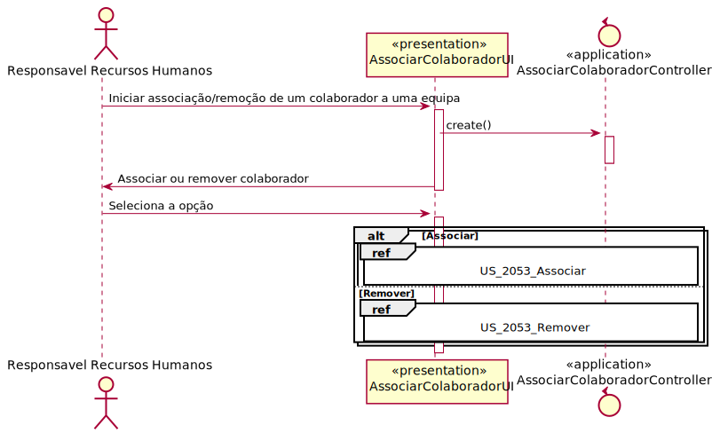
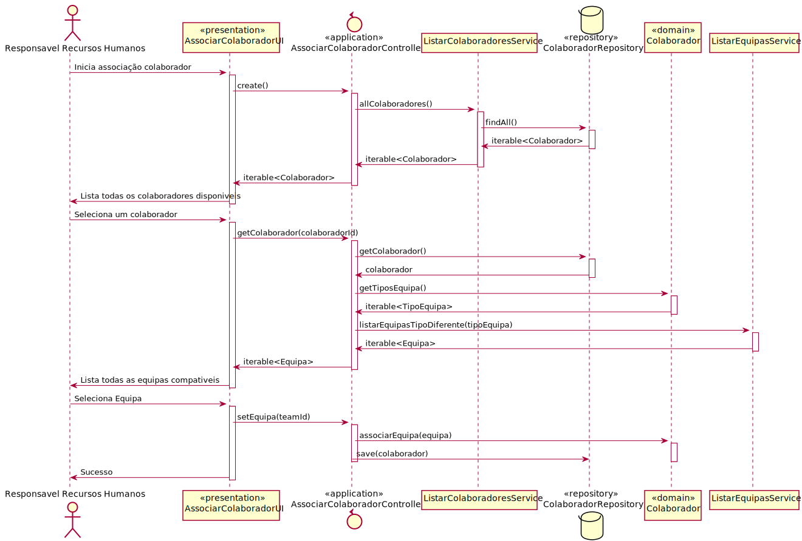
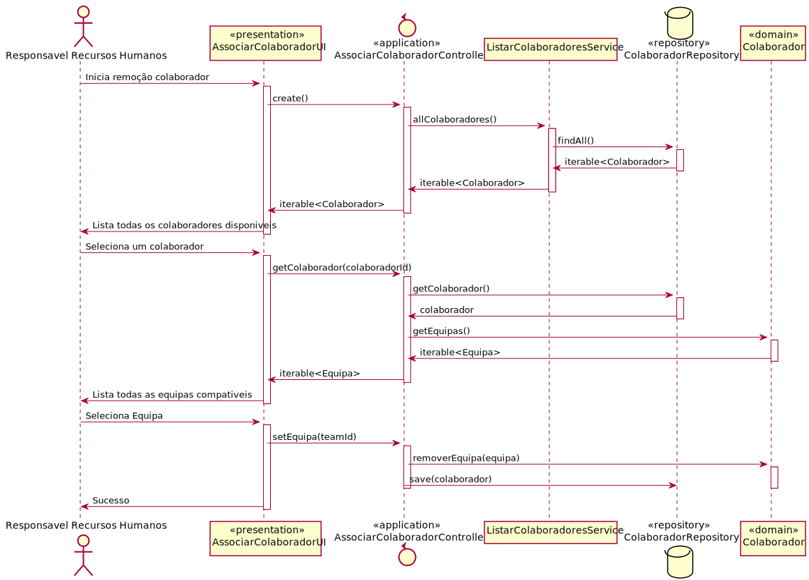

# US_2053 Como RRH, eu pretendo associar/remover um colaborador a uma equipa.

# 1. Análise

#### Requisitos funcionais

O sistema deve permitir associar ou remover um colaborador de uma equipa já criada.

#### Regras de negócio

* Um colaborador pode pertencer a mais do que uma equipa no mesmo instante;
* Um colaborador não pode pertencer a mais do que uma equipa do mesmo tipo;
* Uma equipa pode ficar vazia vazia.

#### Partes interessadas

As partes interessadas nesta US são o colaborador que fica associado a uma equipa ou é removido de uma equipa a qual já não pertence e o responsável de recursos humanos que pretende associar/remover um colaborador a uma equipa.

#### Pré-condições

* Apenas o responsável de recursos humanos (RRH) consegue associar/remover um colaborador a uma equipa.
* Existir colaboradores presentes no sistema para podermos associar/remover o colaborador a uma equipa.
* Existir equipas presentes no sistema para associar/remover o colaborador.

#### Pós-condições

* Associar/remover o colaborador à equipa.

#### Fluxo

O Responsável de recursos humanos (RRH) inicia a associação/remoção de um colaborador a uma equipa. O sistema pergunta se pretende associar ou remover um colaborador de uma equipa. O RRH escolhe que pretende associar um colaborador a uma equipa. O sistema apresenta uma lista de todos os colaboradores. O RRH seleciona o colaborador que pretende e o sistema apresenta uma lista de equipas compativeis (que não tenham o mesmo tipo que outras equipas que o colaborador já pertenca). O RRH seleciona uma equipa a associar. O sistema associa o colaborador à equipa e informa o RRH do sucesso da operação.

#### Fluxos Alternativos

O responsável de recursos humanos escolhe remover um colaborador de uma equipa. O sistema apresenta uma lista de colaboradores. O RRH seleciona um colaborador e o sistema apresenta uma lista de todas as equipas que ele pertence. O RRH seleciona a equipa da qual pretende remover o colaborador. Caso o colaborador seja o unico membro da equipa o sistema avisa o RRH e questiona se pretende cancelar a ação. O sistema remove o RRH da equipa e informa o RRH do sucesso da operação.

# 2. Design

## 2.1. Realização da Funcionalidade

Para associar/remover um colaborador:
	Classes de domínio: Colaborador, Equipa, TipoEquipa;
	Classes de aplicação: ListColaboradoService, ListEquipaService, AssociarColaboradorController;
	classe repositorio: ColaboradorRepository;

## 2.2. Diagrama de Sequência

##  Padrões Aplicados
Padrão GRASP na criação de controladores para atribui a responsabilidade de manipular eventos do sistema para uma classe que não seja de interface do usuário (UI);

#  Observações

Foi escolhida a abordagem de permitir ao RRH selecionar primeiro o colaborador a qual quer realizar a associar/remoção. Futuramente se o numero de colaboradores no sistema o justificar isto poderá ser alterado para um input do Numero do colaborador ou entao permitir ao RRH escolher primeiro a equipa e só depois mostrar os colaboradores compativeis.
