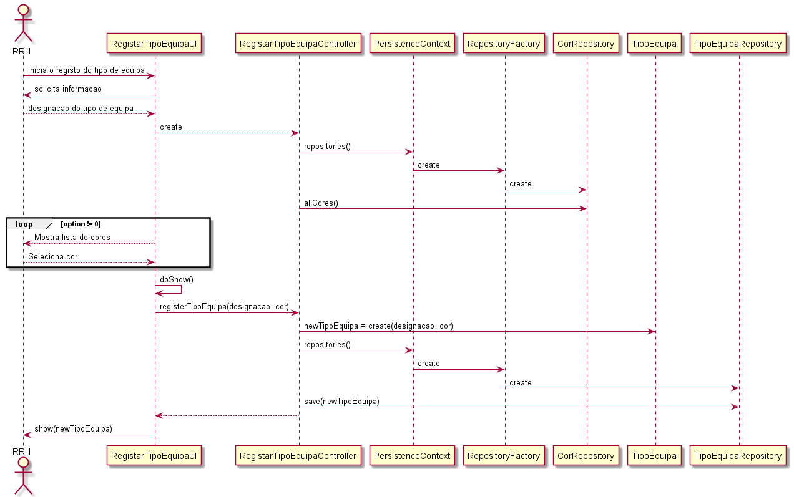
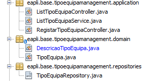

# US_2054
=======================================
# 1. Requisitos

**US_2054** Como Responsável de Recursos Humanos, eu pretendo registar um novo tipo de equipa.

#### Requisitos funcionais

O sistema deve permitir o registo de um novo tipo de equipa, especificando a designação do tipo de equipa e selecionando uma cor de uma lista de cores.

#### Regras de negócio

* O responsável de recursos humanos está encarregue de registar novos tipos de equipa, para posterior associação a diferentes equipas.
* A cada tipo de equipa está associada uma cor, cor tal que, por decisão da equipa, tem uma designação e um código (necessário à identificação da equipa em Java).
* A descrição não deve exceder os 30 caracteres.

#### Pré-condições

* Algumas cores disponíveis à especificação de um tipo de equipa já devem estar contemplados no sistema (bootstrap).

#### Pós-condições

*  O tipo de equipa é registado no sistema, sendo possível ter uma/várias equipas associadas.

#### Fluxo

O Responsável de Recursos Humanos inicia a especificação de um tipo de equipa. É solicitada a designação da equipa e a seleção de uma cor. O sistema valida e regista os dados do tipo de equipa.

# 2. Design

O modelo de domínio foi alterado face ao Sprint A, porque conclui-se que teria lógica uma cor de um tipo de equipa ser uma entidade própria, num agregado separado, porque se iria voltar a utilizar em níveis de criticidade. Portanto, a cor tornou-se uma entidade própria no seu próprio agregado.

Para registar um tipo de equipa:
  Classes de domínio: TipoEquipa
  Controlador: RegistarTipoEquipaController
  Repository: TipoEquipaRepository

Para aceder a cores para registo do tipo de equipa:
  CorRepository

Diagrama de sequência:

## Testes

**Teste 1:** Verificar que não é possível criar um tipo de equipa com descrição null (aplicável aos outros atributos da entidade)

    @Test (expected = IllegalArgumentException.class)
    public void ensureDescricaoTipoEquipaNotNull() {
        new TipoEquipa(null, COR_TIPO_EQUIPA);
    }

**Teste 2:** Verificar que é possível criar uma equipa com descrição válida (aplicável aos outros atributos da entidade)

		@Test
		public void ensureCriarEquipaWithDesignacaoEquipa() throws ParseException {
				fillResponsaveis();
				new Equipa(ACRONIMO_EQUIPA, DESIGNACAO_EQUIPA);

				assertTrue(true);
		}

**Teste 3 e 4:** Verificar que é possível criar um tipo de equipa com uma descrição superior a 30 caracteres, ou inferior, respetivamente

    @Test (expected = IllegalArgumentException.class)
    public void ensureCorDescricaoTipoEquipaExcede30Caracteres() {
        new TipoEquipa(new DescricaoTipoEquipa("descricaoexcedeostrintacaracteresdisponiveis"), COR_TIPO_EQUIPA);
    }

    @Test
    public void ensureCorDescricaoTipoEquipaValido30Caracteres() {
        new TipoEquipa(new DescricaoTipoEquipa("descricao valida"), COR_TIPO_EQUIPA);
    }

# Implementação

Amostra das classes de domínio para evidenciar o uso dos necessários atributos(value objects) e das classes representadas no design do caso de uso.

