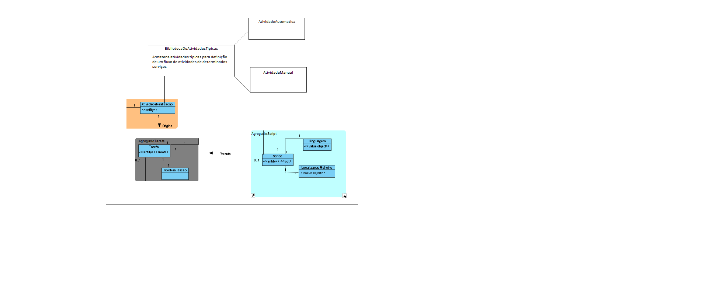

# US_1005
=======================================
# Requisitos

**US_1005** Como Gestor de Projeto, eu pretendo que seja desenvolvida a componente representativa de uma tarefa manual dedicada à apresentação e recolha de informação a/de um utilizador no âmbito de um pedido e que a mesma seja adicionada à biblioteca de atividades típicas do sistema para, dessa forma, poder ser usada na definição de fluxos de atividades.

### Requisitos funcionais

Neste caso de uso não existe nenhuma interação com um ator apenas é necessario preparar o sistema com um tipo de atividade de realização, neste caso manual. É em tudo semelhante à US_1006, só que no caso deste caso de uso, tratar-se-à apenas da realização de tarefas manuais. 

# Design
Escolheu-se representar um modelo de domínio com as alterações necessarias para responder ao caso de uso, sendo que o MD geral não responde aos requisitos. 

Analisando o diagrama, destaca-se o facto de existir uma biblioteca de atividades tipicas que está encarregue de armazenar todo o tipo de atividades pre-definidas, para ser possível a especificação de um fluxo de atividades (apenas se trabalhará com atividades manuais e automaticas por script).

Escolheu-se por criar uma nova aplicação, onde será representada a biblioteca BibliotecaDeAtividadesTipicas, que irá posteriormente ser representada em cada serviço pela atividade de realização. A biblioteca será composta por atividades de realização manual e automática (neste Sprint, apenas por Script).
