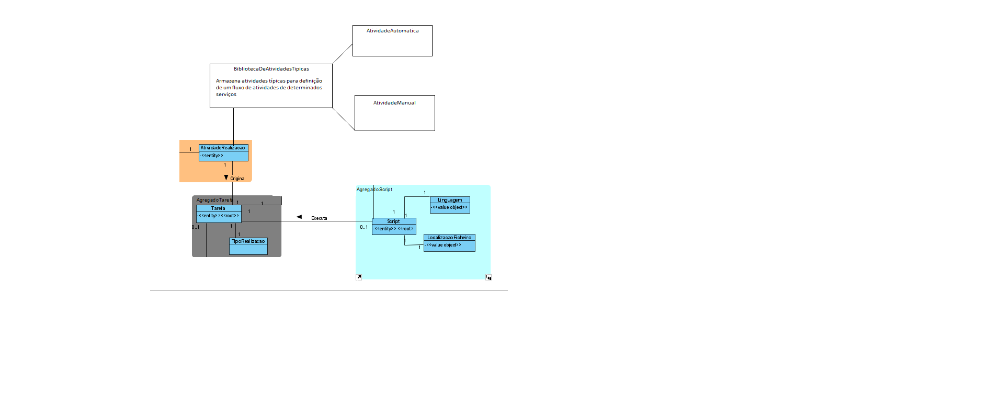

# US_1006
=======================================
# Requisitos

**US_1006** Como Gestor de Projeto, eu pretendo que seja desenvolvida a componente representativa de uma tarefa automática dedicada à execução de um script no âmbito de um pedido e que a mesma seja adicionada à biblioteca de atividades típicas do sistema para, dessa forma, poder ser usada na definição de fluxos de atividades.

### Requisitos funcionais

O caso de uso não terá qualquer interação entre um ator, apenas irá "preparar" o sistema com um tipo de atividade de realização, neste caso, automática baseada em script. É em tudo semelhante à US_1005, só que no caso deste caso de uso, tratar-se-à apenas da realização de tarefas automáticas. 

# Design
Escolheu-se representar um modelo de domínio, sendo que o MD geral não responde aos requesitos do caso de uso. 

Analisando o diagrama, destaca-se o facto de existir uma biblioteca de atividades tipicas que está encarregue de armazenar todo o tipo de atividades pre-definidas, para ser possível a especificação de um fluxo de atividades (apenas se trabalhará com atividades manuais e automaticas por script).

# Implementação

Sendo que se trata apenas de uma classe que garanta a existência de atividades automáticas no sistema, apenas se criou uma classe Java com a informação de uma atividade automática, assim como uma superclasse, chamada atividida, que será extendida nesta classe e na classe de atividades manuais.

# Testes

A testagem para este caso de uso não se demonstrou ser de todo relevante, sendo que apenas adiciona à "biblioteca" do sistema a existência de um novo tipo de atividade.
