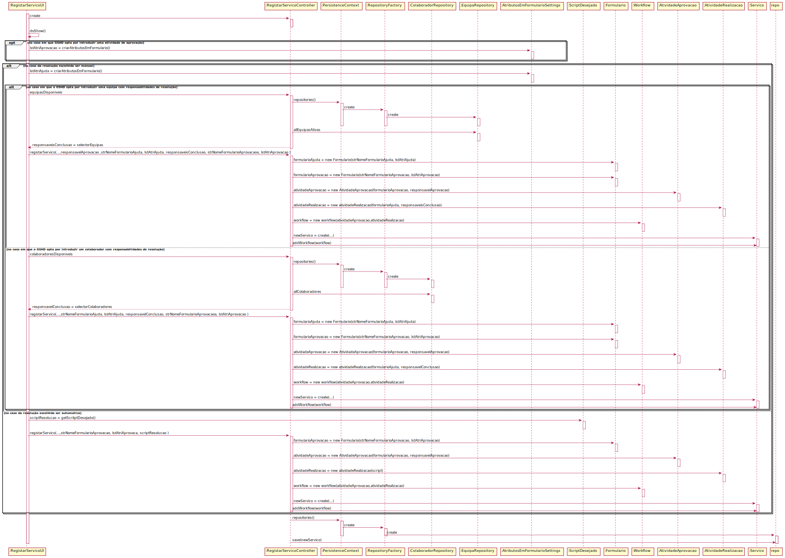

# US_2003

# 1. Análise

A interpretação feita desta US foi no sentido de clarificar o que é um fluxo de atividades e como é que este vai estar contido em serviço.

#### Requisitos funcionais

O sistema aquando do registo de um novo serviço, através do preenchimento e seleção dos diversos campos mencionados na US 2002 terá de especificar o fluxo de atividades pelo qual o serviço se vai reger. Ou seja, terá de se especificar se o serviço quando requerido terá de ter uma aprovação, no caso de este parametro ser necessário teremos de criar um formulário de aprovação e eleger quem será o responsável pela sua aprovação, isto é ou o responsável hierarquico de quem pede o serviço ou o responsável do serviço. O fluxo de atividades terá de ter ainda uma atividade de realização podendo esta ser de dois tipos ou automática ou manual. Na especifição da automática só terá de ser escolhido qual o script que permitirá concluir este serviço. Já na manual teremos de identificar se queremos que seja uma equipa responsável pela conclusão de um serviço ou um utilizador específico finalmente podemos ainda introduzir em alguns casos um formulário de ajuda, a preencher mais tarde pelo o utilizador que requer o serviço para ser mais fácil a sua resolução. O Gestor de Serviços de Help Desk é quem está encarregue de especificar o fluxo de atividades.

#### Regras de negócio

* Apenas o Gestor de Serviços de Help desk (GSH) consegue registar um fluxo de atividades aliado a um serviço no sistema.

#### Partes interessadas

As partes interessadas nesta US são todos os colaboradores pertencentes as equipas especificadas em catálogos que vão ter acesso a estes e que por sua vez podem aceder aos serviços desses catálogos.

#### Pré-condições

* Existirem catálogos no sistema para identificarmos em que catálogo o serviço vai ser disponibilizado.

#### Pós-condições

* Registar o serviço com um fluxo de atividades no sistema.
* Garantir que os as várias possibilidades do fluxo sejam cumpridos.

#### Fluxo

O fluxo inicia-se da maneira específicada na US 2002, porém no final teremos agora a especificação de um um fluxo de atividades. Como tal se for necessário o sistema permite a introdução de uma atividade de aprovação, ou seja permite a seleção do colaborador que irá estar encarregue de aprovar/rejeitar o pedido do serviço(responsável hierarquico ou responsável do serviço em causa), se necessário é ainda possível a introdução de um formulário de aprovação. De seguida o sistema permite a introdução da atividade de resolução do servico, se esta for manual o GSHD terá de introduzir uma equipa/colaborador que estará encarregue de completar o serviço requerido, podendo tambem introduzir um formulário de ajuda. No caso de ser automático o GSHD só terá de selecionar o script que permitirá concluir o serviço.   

# 2. Design

## 2.1. Realização da Funcionalidade

	Para introduzir um fluxo de atividades:
		Classes de domínio: Workflow, AtividadeAprovacao, AtividadeRealizacao, Formulario, Atributo, Equipa, Colaborabor, Servico;
		Classes de aplicação: ListServicoService, ListServicoController, CreateWorkflowController, RegistarServicoController;
		Classe repositorio: WorkflowRepository, AtividadeRealizacaoRepository, AtividadeAprovacaoRepository;

## 2.2. Diagrama de Sequência

## 2.3. Padrões Aplicados

* Padrão GRASP na criação de controladores para atribui a responsabilidade de manipular eventos do sistema para uma classe que não seja de interface do usuário (UI);
* Padrão Creator

# 3. Integração/Demonstração

O principal objetivo deste caso de uso seria registar serviços no sistema com um fluxo de atividade. Para tal, para além de um registo simples de uma entidade na memória, foi necessário garantir que existiam colaboradores/equipas para uma boa criação de fluxo de atividades que conseguissem ter uma atividade de realização manual.
