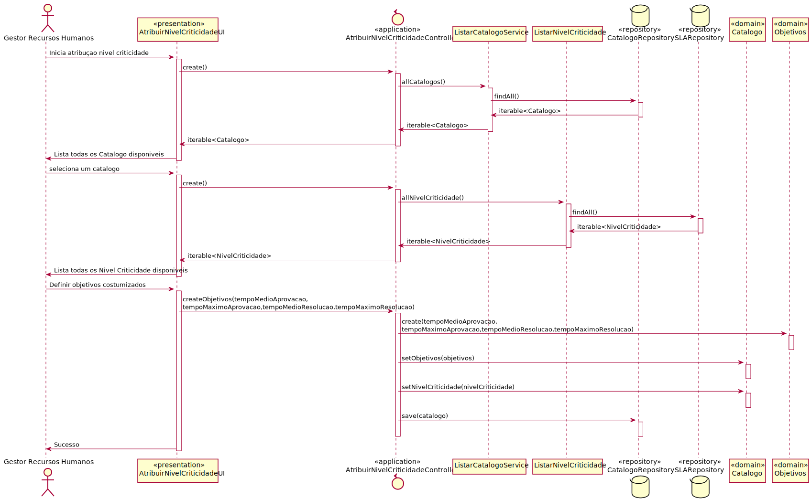

# US_2012 Como GSH, eu pretendo atribuir o nivel de criticidade aplicado a um catálogo de serviços.

# 1. Análise

#### Requisitos funcionais

Associar um nível de criticidade a catálogo de serviço. A associação pode ser:
* a. Básica, no sentido em que os objetivos a serem cumpridos são aqueles que constam no
nível de criticidade associado;
* b. Customizada, no sentido em que os objetivos a aplicar no catálogo são distintos dos
constantes no nível de criticidade associado, ou seja, são redefinidos localmente.

O sistema deve permitir ao GSH atribuir um nivel de criticidade a um catalago de servicos. Caso seja necessario tambem devera permitir a definição de novos objetivos para associar ao catalogo.

#### Regras de negócio

* Um catalogo só pode ter um nivel de criticidade associado;
* Um catalogo pode ter objetivos a aplicar distintos dos definidos no nivel de criticidade associado;
* A associação pode ser basica ou avançada dependendo da necessidade ou não de atribuir objetivos distintos do nivel de criticidade associado.

#### Partes interessadas

As partes interessadas nesta US são o GSH que pretende atribuir um nível de criticidade ao catalogo.

#### Pré-condições

* Apenas o GSH consegue atribuir um nivel de criticidade a um catálogo.
* Existir catálogo e níveis de criticidade presentes no sistema para podermos atribuir o nível criticidade a um catalogo.

#### Pós-condições

* O catalogo fica com um nivel de criticidade atribuido.

#### Fluxo

O Gestor serviços helpdesk (GSH) inicia a atribuição de um nivel de criticidade a um catalogo. O sistema pede ao GSH para selecionar um catalogo e o nivel de criticidade a atribuir. O sistema apresenta as informações do catalogo, nivel de criticidade e objetivos associados ao nivel de criticidade e pergunta ao GSH se pretende definir objetivos costumizados para este catalogo. O GSH seleciona que pretende definir objetivos costumizados. O sistema solicita a informação relevante para a criação dos objetivos. O GSH introduz a informação. O sistema guarda as alterações efetuadas e informa o GSH do sucesso da operação.

#### Fluxo alternativo

O GSH seleciona que não pretende definir objetivos costumizados. O sistema guarda as alterações efetuadas e informa o GSH do sucesso da operação.

# 2. Design

Foi necessario alterar o modelo de dominio para dar resposta a esta US. Inicialmente os objetivos faziam parte do Agregado de SLA e estava apenas associado ao nivel de criticidade. A alteração feita separa os objetivos do agredado de SLA crindo um agregado para os objetivos e cria uma ligação entre catalogo e objetivos o que permite a definição de objetivos costumizados para um catalogo.

## 2.1. Realização da Funcionalidade

Para atribuir um nivel de criticidade a um catalogo:
	Classes de domínio: NivelCriticidade, Catalogo, Objetivos;
	Classes de aplicação: ListNivelCritcidadeService, ListCatalogoService, AtribuirNivelCriticidadeController;
	classe repositorio: SLARepository,CatalogoRepository;

## 2.2. Diagrama de Sequência

##  Padrões Aplicados
* Padrão GRASP na criação de controladores para atribui a responsabilidade de manipular eventos do sistema para uma classe que não seja de interface do usuário (UI);

#  Observações

Foi optado por permitir ao GSH selecionar o catalogo e o nivel de criticidade atraves de uma lista com todos os elementos. Futuramente se for justificado pode ser optado uma pesquisa pelo titulo do catalogo e pela etiqueta de criticidade. Possívelmente podiam ser implementadas ambas as estratégias.