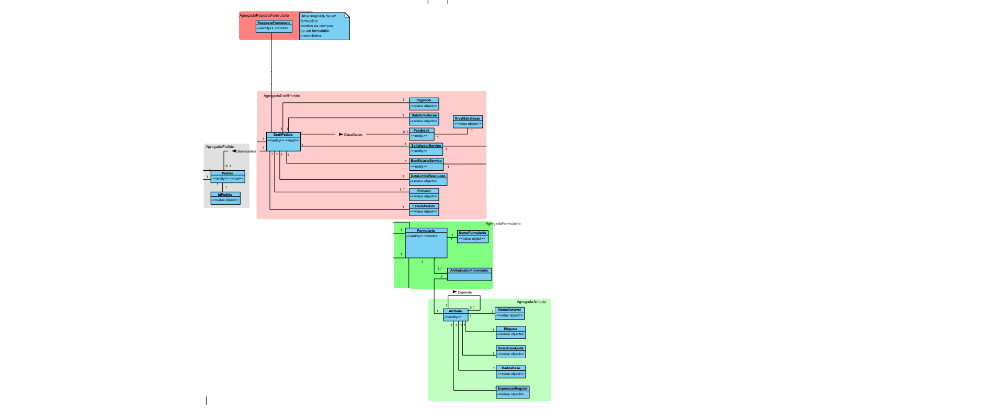
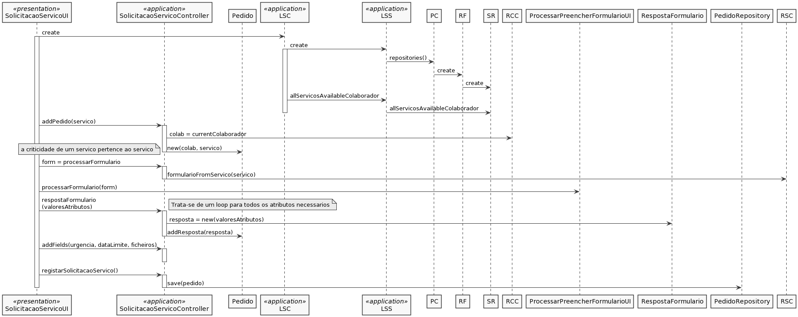

# US_3002
=======================================
# Requisitos

**US_3002** Como utilizador, eu pretendo solicitar um serviço do catálogo de serviços que me é disponibilizado.

#### Requisitos funcionais

Recorrendo ao preenchimento de um formulário, um colaborador pode solicitar um serviço que lhe esteja disponível. No ato de solicitação, é criado um pedido (no Sprint C, não se considera a existência de um draft de pedidos). Este pedido precisa de, para além de dados essenciais ao pedido, a resposta a um formulário de solicitação de serviço, juntamente com resposta de outros formulários.

#### Regras de negócio

* O pedido é caracterizado por identificador automático único e sequencial por ano.
* Para solicitar um serviço, tem que haver serviços disponíveis ao colaborador.
* Um serviço tem que estar disponível para que possa ser solicitado por um colaborador.
* É possível que um utilizador solicite um serviço para outro colaborador.

#### Fluxo

O utilizador inicia a solicitação de um serviço. O sistema, automaticamente, deteta o colaborador que solicitou o serviço, a data de solicitação (data atual), o serviço solicitado e a criticidade a que o serviço está associado. Depois do preenchimento do formulário, é solicitada a urgência do pedido, data limite de resolução do pedido, e um/vários ficheiros a anexar. O utilizador preenche o formulário e insere os restantes atributos. O sistema armazena e valida as respostas ao formulário, assim como os dados de suporte de cumprimento de SLA, e o estado do pedido fica "submetido".

# Design 

É necessário que haja um processamento de um formulário, para o traformar em algo que o utilizador possa interagir. Por esse motivo, é criada uma classe de UI ProcessamentoFormularioUI, que será comum a outros casos de uso que necessitem de preenchimento de formulário. No domínio também terá que existir uma classe de Resposta de Formulário, que monta toda a estrutura de resposta a um formulário. 
A obtenção de um formulário para ser possível fazer o processamento, será feito através de um DTO só com as informações necessárias ao caso de uso. 

Para este caso de uso, foram necessárias alterações no modelo de domínio, sendo que havia em falta um conceito de Resposta a um formulário. No Sprint atual, o cliente não necessita que haja um draft de pedido, ou seja, na solicitação de um serviço, um pedido será criado obrigatoriamente.

O diagrama de sequência é essencial para a organização do caso de uso, e para ser possível implementar os requesitos, sendo que é um caso de uso que engloba muitos conceitos diferentes:

#### Abreviações do SD:
* LSC: ListServicoController.
* LSS: ListServicoService.
* PC: PersistenceContext.
* RF: RepositoryFactory.
* SR: ServicoRepository.
* RCC: RegistarColaboradorController.
* RSC: RegistarServicoController. Nesta classe, obtém-se um formulário no formato DTO.

# Implementação

Existe um processamento de uma formulário (recorendo a classes de UI), em que um formulário registado no ato de especificação de serviço é processado de modo a ser mostrado a um utilizador e que possa ser respondido. A obtenção da informação de um formulário de um serviço a ser solicitado será feita através de um DTO de formulário. Através de queries criadas para este Sprint, em ServicoRepository, são obtidas todos os serviços que o utilizador pode solicitar. Portanto, o foco principal deste caso de uso era o correto uso de queries para obter toda a informação necessária relativa a serviços disponíveis, e respetivos atributos, assim como seguir uma abordagem com DTOs para evitar a obtenção de informação desnecessária ao utilizador.

# Testes

À medida que se vai fazendo a implementação, principalmente no conceito de domínio, a testagem vai acompanhar o código. Ou seja, as regras de negócio/registo serão logo testadas após implementadas.

A testagem foi feita apenas às restrições em relação aos atributos necessários a um serviço, ou seja: 
-invalidar a solicitação de um serviço onde o solicitador não está loggado corretamente, ou seja, uma solicitação com um colaborador inválido; 
-invalidar solicitação de um serviço que não existe (em UI, é impossível que aconteça, mas para caso de bootstrap/registo sem interação com o utilizador, era necessário validar tal informação);
-para além do construtor de um serviço, existe também um método que adiciona o campo de urgência e de data limite, consequentemente, a testagem individual da validação/invalidação da inserção destes dados foi necessária;
-por fim, obviamente, era necessário testar que todos os dados eram corretamente introduzidos.
