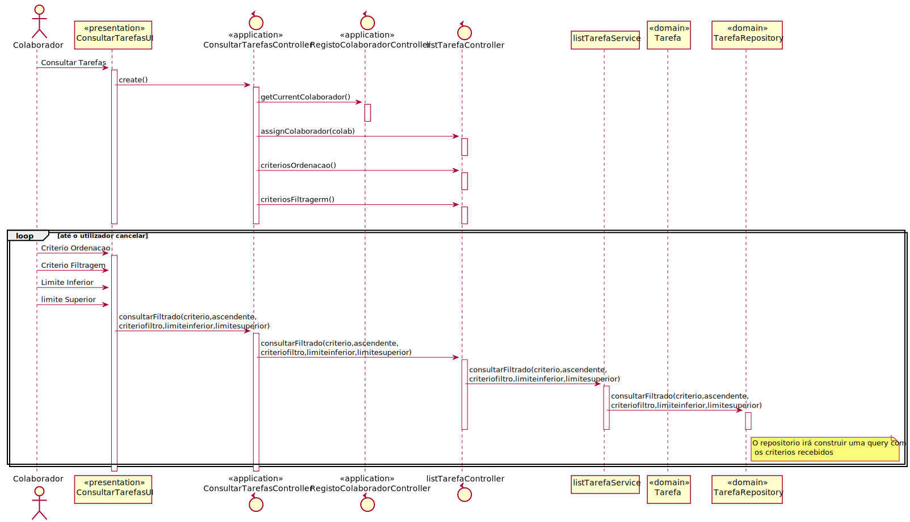
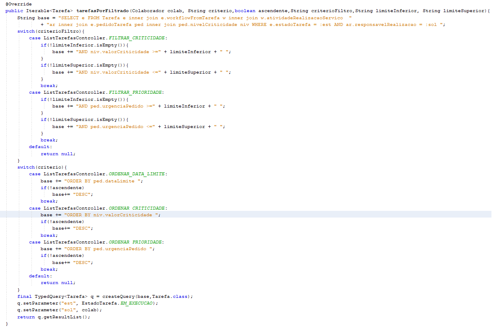

# US_3021
=======================================
# 1. Requisitos
**US_3021 -** Como utilizador, eu pretendo consultar as tarefas pendentes que me estão assignadas.

#### Requisitos funcionais

O sistema deve permitir ao utilizador que consulte as tarefas que lhe estão atribuidas ou que ele possa reivindicar. Devem também permitir ao utilizador filtras e ordenar as tarefas.

#### Regras de negócio
Apenas devem ser visíveis as tarefas atribuidas ao utilizador.

#### Pré-condições

* O utilizador está registado no sistema.
* O utilizador tem tarefas atribuidas.

#### Partes interessadas

As partes interessadas nesta US será o utilizador que pretende consultar as tarefas que tem atribuidas.

#### Fluxo

O utilizador solicita a lista de tarefas que tem atribuidas. O utilizador seleciona o criterior de ordenação, se pretende ordenar por ordem ascendente e se pretende filtrar os dados. Caso escolha filtrar os dados também seleciona o criterio de filtragem a usar, o limite inferior e superior. O sistema motra a lista de tarefas ordenadas e filtradas. O utilizador cancela e o caso de uso termina.

# 3. Design

## 3.2. Diagrama de Classes

## 3.3. Padrões Aplicados

* Padrão GRASP na criação de controladores para atribui a responsabilidade de manipular eventos do sistema para uma classe que não seja de interface do usuário (UI);
* DTO - Data transfer object nas transferencias de dados de modo a otimizar a comunicação.

# 4. Implementação

Na implemtenação deste caso de uso foi criado um controller das listagens de tarefas que tem a responsabilidade de conhecer e disponiblizar os criterios de ordenação/filtragem que podem ser usados. Esta classe irá depois solicitar a query atravez de um servico de listagem que por sua vez acede ao repositorio,

Na construção das queries é adicionado a uma query de base a informação necessaria de acordo com os criterios recebidos como demostrado na imagem.

# 5. Observações

Futuramente poderá ser adicionado ao sistema novos criterios de ordenação e filtragem.