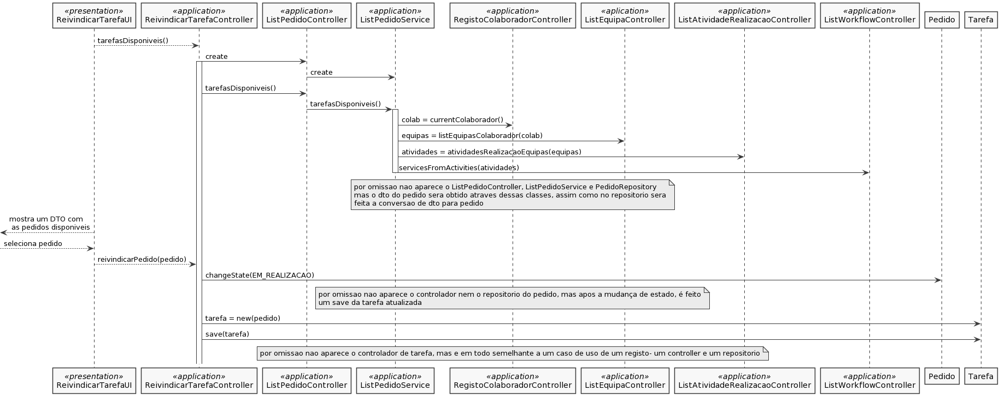

# US_3022
=======================================
# Requisitos

**US_3002** Como utilizador, eu pretendo consultar as tarefas pendentes que eu posso reivindicar para mim e, caso o deseje, concretize essa reivindicação.

## Requisitos funcionais

Tendo em conta que a cada serviço existe alguém que a realize (caso seja manual), é possível que um utilizador possa reivindicar um serviço, desde que este pertença à equipa em que este está enquadrado. Desse modo, esta reivindicação trata-se apenas para tarefas manuais, e que não foram automaticamente assignadas a um colaborador, mas sim a uma equipa a que esse colaborador pertence.
Para isso, algumas alterações terão que ser feitas, nomeadamente na especificação de um serviço, é necessário que seja indicado qual/quais equipa(s) podem realizar o serviço. Essa parte do caso de uso vai ser feita em conformidade ao caso de uso 2003, onde se tem que completar a especificação em curso de um serviço. Aí será adicionado o fluxo de atividades.
É também necessário garantir que 

#### Pré-Condições
* Para um utilizador reivindicar uma tarefa, é necessário que hajam serviços assignados às equipas a que ele pertence (de tipo de resolução manual), de modo a poder executá-los.
* A tarefa tem que estar totalmente especificada. 

#### Fluxo
O utilizador começa a reivindicação de uma tarefa, o sistema mostra as tarefas ainda não assignadas disponíveis ao utilizador para realizar. O utilizador seleciona a tarefa que pretende reivindicar. O sistema confirma a reivindicação da tarefa.

## Design

Devido à complexidade do caso de uso e da interligação entre diferentes casos de uso, foi decidido que a melhor maneira de organizar o caso de uso era responder a algumas perguntas essenciais à estrutura do caso de uso:

* (Q) Quem pode reivindicar tarefas?
* (A) Um colaborador que pertença a uma equipa que tenha serviços associados a realizar.
* (Q) Como se pode saber quais são as equipas a que o colaborador pertence?
* (A) Vai distribuir-se em passos a obtenção de uma equipa de um utilizador:
    * currentColaborador()- método do RegistoColaboradorController, recorrendo ao AuthorizationService, que consegue obter o username do colaborador que atualmente está "loggado". Ao obter o username do utilizador (corresponde ao número mecanográfico de um colaborador), é chamado do repositório uma query que "descobre" o colaborador com o respetivo número mecanográfico.
    * listEquipasColaborador(colaborador)- método da classe ListEquipaController, e consequentemente em ListEquipaService, que obtém a lista de equipas a que um colaborador pertence simplemente invocando o atributo equipas do colaborador enviado por parâmetro.
* (Q) Agora que se sabe as equipas a que um utilizador pertence, como é que se pode obter os pedidos que foram atríbuidos a estar equipas para uma futura realização:
    * Na especificação de um serviço, em conformidade do caso de uso 2003, se a atividade de resolução for atribuída a uma equipa, é possível que o colaborador possa reivindicar pedidos desse serviço
        * Como? Irá ser criada uma query no repositório de atividade de realização para, a partir das equipas do colaborador, obter as atividades de realização associdas às equipas. (AtividadeRealizacaoRepository que será chamado em ListAtividadeRealizacaoController e ListAtividadeRealizacaoService)
        * Depois de obter as atividades de realização, irá obter-se os workflows (também através de uma query), que pertencem a serviços, sendo assim possível obter os serviços que cada equipa poderá realizar. (WorkflowRepository que será chamado em ListWorkflowController e ListWorkflowService)
        * Depois, fazendo uma query por todos os pedidos registados até ao momento que pertencem aos serviços da equipa, que estão no estado submetido (ou seja, ainda não estão atribuídas a ninguém e não precisaram de aprovação) ou que estão aprovados, é mostrada ao colaborador todos os pedidos que ele pode reivindicar (PedidoRepository)
* Logo após esta reivindicação de um pedido, é criada uma tarefa. (Tarefa em domínio, com respetivo controlador RegistarTarefaController e TarefaRepository)

## Implementação

O caso de uso revela-se trabalhoso sendo que são necessárias inúmeras queries de obtenção de informação para necessária à reivindicação de um pedido feito por um outro qualquer utilizador. Mais uma vez, seguindo uma metodologia de UI-Controller-Repostório, é assim que se garante a organização e correto funcionamento do caso de uso. Seguiu-se também o correto uso de DTOs para obtenção de pedidos, sendo que era em nada necessária ao utilizador a reivindicar a tarefa toda a informação de um pedido/serviço.

## Testagem

Sabendo que se trata apenas de uma seleção de serviços disponíveis ao utilizador, não foi feito qualquer tipo de testagem funcional relativa ao caso de uso. Contudo, sabendo que 95% do caso de uso são queries, apenas era necessário garantir a correta obtenção de informação. Desta forma, a equipa comprometeu-se a fazer uma testagem intensiva relativamente aos diferentes colaborador e serviços já registados em bootstrap, de modo a prevenir 

