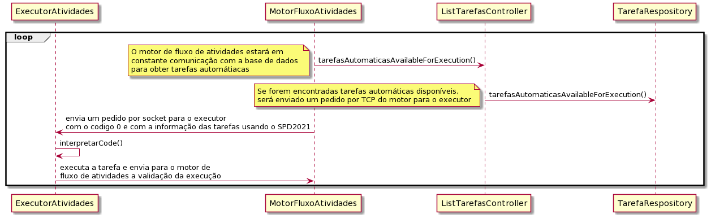

# US_3022
=======================================
# Requisitos

**US_3002** Como Gestor de Projeto, eu pretendo que seja desenvolvido o Executor de Tarefas Automáticas.

## Requisitos funcionais e Analise

Recorrendo ao Transmission Control Protocol(TCP), pretende-se que seja feito um executor de tarefas automáticas (no âmbito deste sprint, apenas será feita uma simulação), que permita que tarefas já aprovadas (caso não necessitem de aprovação, vão ser diretamente realizadas), possam ser executadas (no futuro recorrendo a um script). 
No âmbito deste sprint, a aplicação cliente, Motor de Fluxo de Atividades, irá solicitar, sincronamente e o número de vezes que for necessário, a execução automática(mock), e a aplicação servidora, Executor de Tarefas Automáticas, tem que estar preparado para receber tais pedidos e realizar as tarefas. No fim, o servidor vai enviar para o cliente uma mensagem de feedback a indicar que a execução foi bem executada, ou não.

### Fluxo

Estando o servidor ativo e em funcionamento, ele espera pedidos de execução de tarefas automáticas.
Aquando da solicitação de um serviço, automático (no âmbito deste sprint, sem aprovação), é enviado para o motor de fluxo de atividades (base de dados), a tarefa a ser executada. O Cliente testa a ligação para verificar se o servidor está ativo e em ligação com o cliente. O Servidor responde com 2 (validação). O Cliente (Motor de Fluxo de Atividades) envia um pedido de execução de uma certa tarefa. O servidor executa a tarefa e envia uma mensagem de sucesso para o cliente. Por fim, a ligação TCP é quebrada (apenas está ativa para a execução de uma tarefa automática).

## Design 

Será criada uma classe chamada ExecucaoAtividades, que irá agir como um servidor para o Motor de Fluxo de Atividades (outro caso de uso). Recorrendo à classe ServerSocket, irá ser instânciado o socket com o port 32507.
A verificação da versão do SPD tem que ser feita, assim como a interpretação do código. 
É necessário que haja obtenção de informação de tarefas automáticas para o motor de fluxo de atividades, para isso, o motor de fluxo de atividades só irá enviar um pedido ao executor de atividades automáticas quando forem encontradas tarefas automáticas por executar na base de dados. 

## Implementação 

Recorreu-se a um mecanismo de Threads (motor de fluxo de atividades), para que fosse possível o motor de fluxo de atividades estar a executar em modo servidor e em modo cliente em simultâneo. Com a execução do executor de tarefas automáticas, também a utilizar um mecanismo de Threads, era possível que este pacientemente espera-se pela receção de pedidos do cliente, sem nunca para a execução, para que fosse possível fazer o mock da simulação da execução das tarefas automáticas. 
O Executor de Tarefas Automáticas, que está a executar no SSH 5, com o Port 32507, irá criar um server socket mal o ficheiro executável run-executoratividades.sh for corrido. Aquando da execução do ficheiro executável, o ServerSocket é automáticamente instanciado.
Dentro do executor de atividades, mal o pedido do cliente chegar, será feita a interpretação da versão e do código, para que este saiba o que deverá fazer. 
No âmbito deste sprint, houve dificuldade em fazer com que várias instâncias do servidor de executor de atividades automáticas estivesse a funcionar. Portanto, apenas se usou a execução de um servidor de executor de atividades automáticas. 

