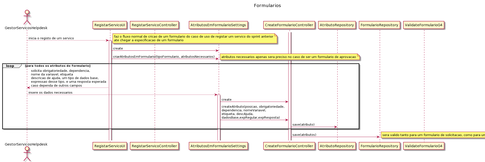
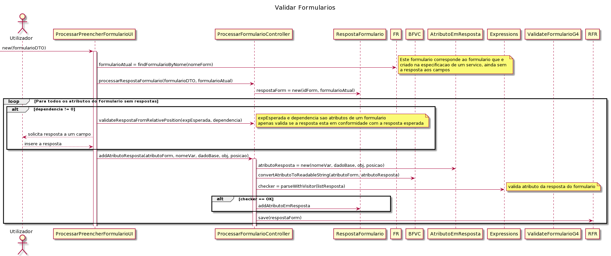
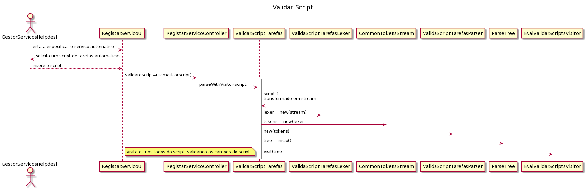

# US_1007
=======================================
# Requisitos

**US_1007** Como Gestor de Projeto, eu pretendo que o sistema seja capaz de executar/interpretar os scripts especificados na linguagem/gramática anteriormente desenvolvida.   

## Requisitos funcionais

Com objetivo de completar o antigo caso de uso 1004 do sprint passado, será necessário desenvolver a gramática para as tarefas automáticas, de maneira a ser possível serem executados script para tarefas, e também como para os formulários, de maneira a validar a criação e resposta de um formulário. No âmbito do caso de uso, terá que ser necessário o gestor de serviços helpdesk inserir/especificar um formulário, tendo em conta todo o fluxo entre atributos, e o sistema validar este formulário por ele introduzido (não será introduzido um script, mas serão introduzidos os respetivos atributos de um formulário na consola). Será também preciso, no ato de especificação de um serviço, que o gestor de serviços helpdesk especifique/introduza um script de tarefa automática, de modo a identificar os campos necessários para a correta execução de uma tarefa automática.

## Pós-Condições 

* Será possível criar formulários com atributos dinâmicos, com dependência entre campos e com diferentes fluxos de resposta (e.g Se o campo A for 1, então será possível responder ao campo C. Se o campo A for 2, será possível responder ao campo B).
* Será possível analisar script introduzidos por um gestor de serviços helpdesk no ato de especificação de um serviço, para saber qual a tarefa automática a executar.
* Quando um utilizador solicitar um serviço, será possível subtituir os valores preenchidos de um formulário pelos respetivo campo no script.

# Design 

Para o desenvolvimento do caso de uso, seria necessário subdividi-lo em dois: formulários e tarefas automáticas.

### No caso dos formulários:
Sabendo que é necessário garantir que o formulário necessita dependência entre campos, optou-se por não fazer formulários com atributos/campos fixos, mas sim campos dinâmicos, que serão especificados consoante a criação do campo na especificação de um servico, ou seja: Ao especificar o campo A, indica-se se ele vai ser obrigatório e se depende de algum campo (sendo este o campo inicial, não pode dependender de nenhum campo). No campo B, indica-se mais uma vez se ele vai ser obrigatório ou não, e também se indica se depende de algum campo. Imaginando que o campo B depende do campo A, será solicitada uma resposta esperada do campo A para surgir o campo B, por exemplo: Campo A- Idade; Campo B- Salário da reforma (só poderá aparecer este campo se o campo A for maior que 65). No âmbito deste caso de uso, tendo por base o que haveria sido feito no sprint anterior, a equipa decidiu não fazer um script que validasse o formulário aquando da sua espeficação, pois nunca haveria hipótese de erro, sendo que na criação de um formulario está a ser possibilitado definir se um campo depende de algum campo e uma resposta esperada para que esse campo seja pedido num formulário. Apenas será feita a validação das respostas de um formulário, recorrendo ao antlr4, tendo por base todas as especificações atribuídas a um formulário na sua criação, recorrendo a uma gramática ValidateFormulariosG4.

Face a alterações que terão que ser feitas no caso dos formulários, tornou-se relevante demonstrar a nova especificação de um formulário e respetivos atributos, no ato de especificação de um serviço.

De modo a não sobrecarregar casos de uso onde se tem que chamar a validação de formulários com a respetiva resposta, irá ser demonstrado o diagrama de sequência genérico onde esta é chamada.

É de destacar que para interação da gramática com a classe Expressions será feita através de um Visitor (EvalVisitor), que irá iterar pela resposta de um formulário (lista de atributos a ser recebido por parâmetro no método parseWithVisitor), obedecendo a todos os tokens da gramática.

### No caso das tarefas automáticas:

Para as tarefas automáticas vai ser criado um script para determinar a tarefa automática a ser executada, pelo gestor de serviços helpdesk, no ato de especificação de um serviço. Esse script vai conter, por exemplo: identificador email nome produto valor desconto. Com esta frase, a gramática irá interpretar cada campo (já se encontram predefinidos na gramática), e através da interpretação do campo, recorrendo a um Listener (TarefasAutomaticasListener com a classe EvalListener), validá-los. Após uma validação bem sucessida, armazenar-se-à na Base de Dados este script, nomeadamente como uma AtividadeAutomatica (pertencente a um workflow de serviços).

Tendo então o script já na base de dados, a cada solicitação do respetivo serviço, o utilizador ficará encarregue de, através de um formulário (preenchimento de um formulário com base no diagrama de sequência genérico), indicar todos os atributos necessários à realização de um serviço automático (os campos serão processados de acordo com a especificação do formulário na especificação do serviço). A cada preenchimento de um campo individual, será alterada a String com o respetivo script criado pelo gestor de serviços helpdesk, entrando aqui uma nova gramática- RespostaParaScript.g4. Esta gramática ficará encarregue de detetar a que campo do script pertence o atributo preenchido no formulário, e subtituir, recorrendo a um Visitor, por exemplo: 
* Script do serviço: identificador tipo desconto quantidade tipo cliente
* O colaborador começa a solicitação do serviço:
    * Campo 1 do serviço: id do cliente- utilizador preenche com: **Cli3**
    * Gramática irá validar este campo e substituir na string a respetiva expressão correspondente, neste caso, identificador- script atualizado:
        * **Cli3** tipo desconto quantidade tipo cliente
    * Campo 2 do serviço: tipo de cliente: utilizador preenche com  : **nacional**
    * Gramática irá validar este campo e substituir na string a respetiva expressão correspondente, neste caso, identificador- script atualizado:
      * **Cli3** tipo desconto quantidade **nacional**.
      * (etc)

Esta substituição irá acontecer até todos os campos estarem substituídos, se não, irá ser lançado um erro. Se por acaso todos os campos tiverem sido corretamente substuídos, significa que já poderá ser guardada na base de dados um pedido novo (tarefa se não precisar de aprovação), com o respetivo script novo atualizado.

Tendo agora estas duas gramáticas implementadas, imaginando que ou não era necessária aprovação, ou que esta já tinha sido feita, será necessário implementar a execução do script automático. Para tal, recorrendo a uma gramática chamada TarefasAutomaticas.g4, irão ser validados e interpretados todos os campos do novo script de acordo com as especificidades de cada um, recorrendo a um Listener (EvalListener), chamado por uma classe TarefasAutomaticasExecutor. Tendo sido todos os dados validados e interpretados, no Listener, irão existir diversos "analisadores" de campos, que irão verificar se o script poderá fazer cálculos e/ou consulta e/ou enviar emails. Tendo em conta a análise feita, e todas as ações previamente enumeradas, irá ser executado o script.

O diagrama de sequência da gramatica de conversão de respostas de um formulário para script irá ser demonstrado na documentação do caso de uso 3003- Solicitar serviço de catálogos- e da execução das tarefas automáticas, será no caso de uso 5003- Tornar o executor de tarefas automáticas robusto.

# Implementação

Obviamente, para a criação das diferentes gramáticas foi usado o ANTLR4. Foi decidido que seriam usados um Listener e três Visitors: visitor para validação de formulários, para validar script introduzidos por um gestor de serviços e para a conversão de respostas de um formulário num script pronto a ser executado;  listener para executar as tarefas automáticas, tendo em conta as diferentes especificidades da gramática, e identificação/validação de campos.

