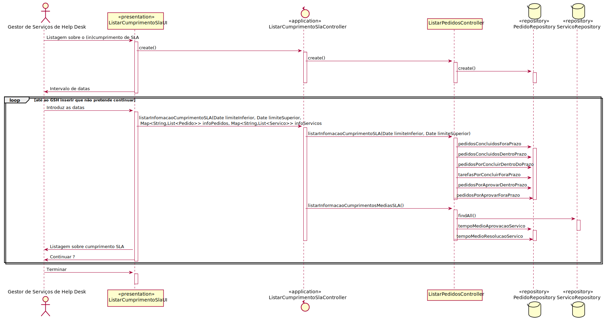

# US_2013

# 1. Análise

#### Requisitos funcionais

Como GSH, eu pretendo obter uma listagem sobre o (in)cumprimento do SLA das solicitações recebidas e já concluídas num determinado intervalo de tempo.

#### Regras de negócio

* Para efeitos de averiguação do cumprimento (ou não) do contrato de SLA é importante o sistema ter a capacidade de identificar por cada serviço solicitado a sua conformidade e contribuição (negativa ou positiva) relativamente ao SLA.
* Normalmente, os objetivos do catálogo são iguais aos previstos no respetivo contrato para o nível de criticidade respetivo.
Contudo, há casos em que é importante poder configurar objetivos/valores distintos para um
catálogo. Em geral, todos os serviços regem-se pela criticidade e objetivos do catálogo através do qual 
8
são disponibilizados
#### Partes interessadas

As partes interessadas nesta US são o GSH que pretende definir os niveis de criticidade e futuramente atribuir estes a catalogos ou servicos.

#### Pré-condições

* Existem Pedidos no sistema.

#### Pós-condições

#### Fluxo

O Gestor de Serviços de Help Desk (GSH) pede uma listagem sobre o cumprimento do SLA, o sistema solicita o intervalo de datas a considerar. O GSH introduz estas datas e o sistema apresenta os serviços em cumprimento ou incumprimento dos SLA. O sistema pergunta ao GSH se pretende continuar. Estes passos repetem-se até o GSH inserir que não pretende continuar. O caso de uso termina.

#  Design

## Diagrama de Sequência

##  Padrões Aplicados
* Padrão GRASP na criação de controladores para atribui a responsabilidade de manipular eventos do sistema para uma classe que não seja de interface do usuário (UI);

