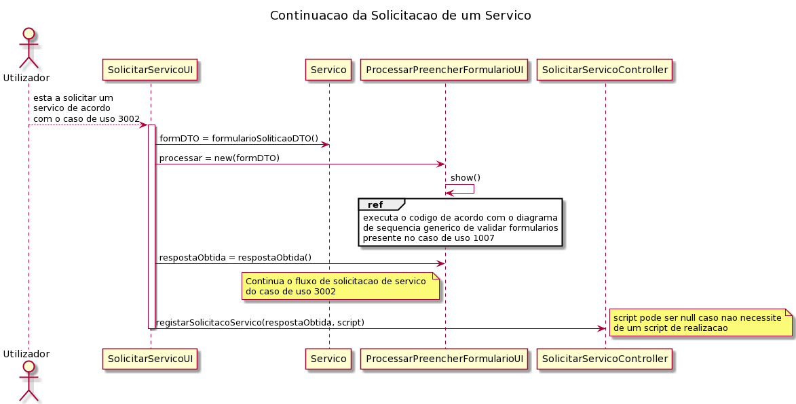

# US_3003   
=======================================
# Requisitos

**US_3003:** Como utilizador, eu pretendo solicitar um serviço do catálogo de serviços que me é disponibilizado.

## Analise

Tendo por base o caso de uso 3002 do sprint C, será necessário adicionar ao caso de uso o conceito da validação de formulários, criados no caso de uso 1007. Aquando da solicitação de um serviço, para além dos dados já pedidos, no processamento das respostas a cada campo, será necessária a sua validação.

### Pré-condições
* O utilizador tem serviços disponíveis a serem solicitados.
  
### Pós-condições
* O utilizador tem os campos da resposta a um formulário todos validados

### Fluxo

O utilizador começa a solicitação de um serviço de acordo com as especificidades do caso de uso 3002. Quando começar o preenchimento do formulário, cada campo terá que ser validado tendo em conta as necessidades de cada um (criado no registo de um serviço). O sistema valida todos os campos e continua com o fluxo normal da solicitação de um serviço.

## Design

Quando um serviço está a ser registado, é obrigatório que o seu formulário de solicitação seja criado. Em cada campo do formulário de especificação, é definido qual a resposta que cada um terá que ter, de modo a que os valores sejam validados e que se mostra ao utilizador campos que dependem da resposta do campo que acabou de preencher.
Por opção da equipa, a validação da resposta de um campo será feita não só pela gramática, mas também pelo match, um método predefinido das Strings do Java. 
Um serviço só será registado se todos os campos forem validados individualmente e coletivamente.

# Implementação

Recorreu-se ao uso de DTOs para obtenção do formulário de solicitação, para que haja o processamento do respetivo formulário de solicitação pertencente ao serviço.