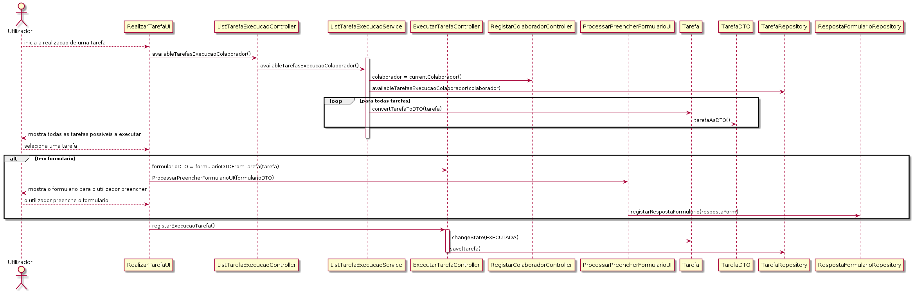

# US_3023
=======================================
# 1. Requisitos

**US_3023:** Como utilizador, eu pretendo realizar uma tarefa que tenho como pendente.

# Analise

Recorrendo à linguagem previamente criada para validação de formulários, é necessário garantir que um utilizador pode realizar uma tarefa que tem como pendente (caso exista formulário de realização).

### Pré-condições

* O utilizador tem tarefas pendentes para realizar (já reivindicou ou foi atríbuido).

## Fluxo

O utilizador solicita a execução de um pedido. O sistema mostra todos os pedidos que pode realizar. O utilizador seleciona o pedido a executar. O sistema mostra toda a informação disponível até ao momento do pedido em causa. O utilizador faz algo fora do sistema para a execução do sistema, e preenche o formulário de resolução. O sistema valida e dá a tarefa por concluída.

# Design

Para a orientação do caso de uso, vão-se colocar perguntas chave para a implementação, e a respetiva resposta irá coordenar o fluxo de trabalho:
 *(Q) Como se sabe quais são as tarefas que estão pendentes?
 *(R) Através de uma query no repositório das tarefas, sabendo qual é o colaborador que está "loggado", o sistema vai procurar na base de dados quais são os tarefas que estão no estado de EM_EXECUCAO, destinados à realização por parte do utilizador.
 *(Q) Como se sabe qual o formulário para o preenchimento do utilizador?
 *(R) Cada tarefa tem um pedido associado, e, logicamente, cada pedido pertence a um serviço. Sabendo este conjunto de informações, a tarefa herda do serviço o seu workflow. Consequentemente, dentro do workflow está o tipo de atividade de resolução atribuído ao serviço. Com a atividade de resolução (neste caso, obviamente manual), está associado um formulário, representativo da resolução manual. 

 Para uma orientação mais rigorosa, decidiu-se elaborar uma diagrama de sequência:

  

 # Implementação

 No caso de uso utilizam-se DTO para obtenção apenas da informação necessária de uma tarefa que seja posível executar, assim como a informação de um formulário de realização que é necessário preencher para finalizar a execução de uma tarefa.