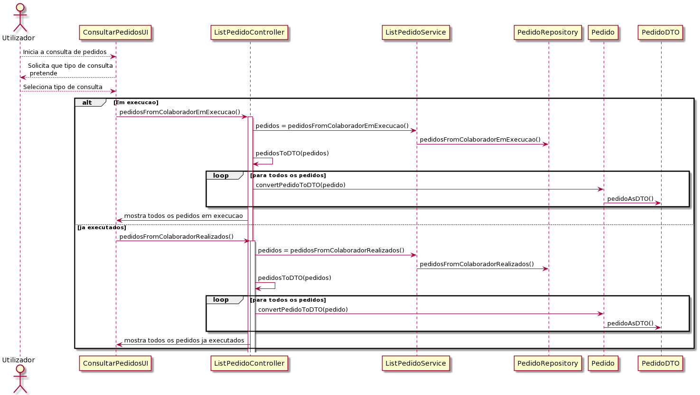

# US_3031
=======================================
# 1. Requisitos

**US_3031:** Como utilizador, eu pretendo consultar os meus pedidos (em curso ou o histórico) e respetivos detalhes/estado.

## Analise

O objetivo deste caso de uso é dar a mostrar ao utilizador, quais serviços solicitados por ele ainda não estão terminados, e também é necessário mostrar todos os pedidos de serviços já executados (histórico). 

### Pré-condições

* O utilizador já solicitou pelo menos um serviço.

### Fluxo

O utilizador seleciona a opção de consulta de pedidos. O sistema solicita qual o tipo de pedidos o utilizador pretence consultar (em execução ou histórico de pedidos). O utilizador seleciona a opção que pretende. O sistema mostra ao utilizador os pedidos de acordo com a opção selecionada.

## Design

Para a orientação da execução do caso de uso foi escolhida a realização de um diagrama de sequência face à facilidade de demonstração da interrelações entre as classes. 

## Implementação

Para além do uso de queries para obtenção de pedidos em execução, ou já realizador po um colaborador, recorreu-se também ao uso de DTO para que apenas seja listada a informação necessária. A conversão de um pedido de DTO para pedido normal também será feito através de uma query, que irá procurar o pedido que tem o respetivo identificador que existe no DTO.