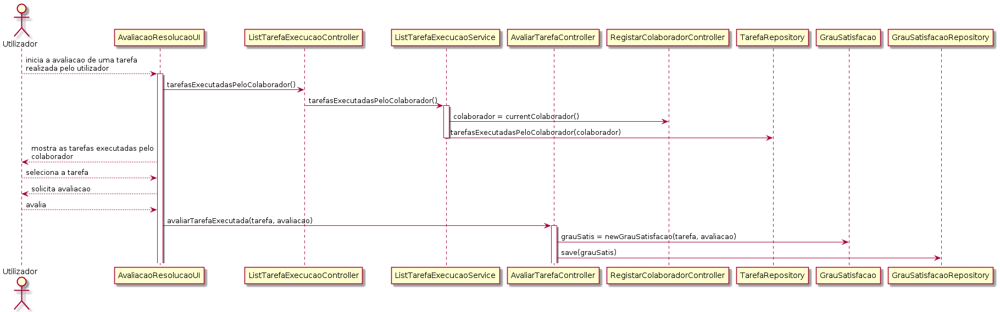

# US_3051   
=======================================
# Requisitos

**US_3031:** Como utilizador, eu pretendo transmitir o meu grau de satisfação sobre a resolução de um dado pedido por mim efetuado. 

## Analise

Após a realização de um pedido por parte do utilizador, pode existir a possibilidade de este avaliar o pedido por ele efetuado. Esta avaliação terá por base da decisão do utilizador o cumprimento ou não cumprimento de todos os requesitos necessáiro para a execução do pedido.

### Pré-condições

* O utilizador já realizou um ou mais pedidos.

### Fluxo

O utilizador seleciona um pedido por ele executado para poder avaliar quanto ao grau de satisfação. O utilizador avalia a tarefa por ele executada, e o sistema guarda a avaliação.

## Design
Para a orientação da execução do caso de uso foi escolhida a realização de um diagrama de sequência face à facilidade de demonstração da interrelações entre as classes. 

