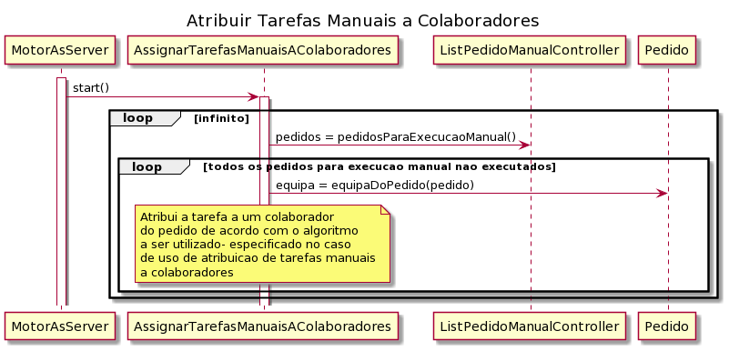

# US_4003
=======================================
# Requisitos

**US_4003** Como Gestor de Projeto, eu pretendo que a equipa conclua o desenvolvimento do motor de fluxos de atividades tornando-o bastante robusto.

## Analise

Tendo por base todas os novos casos de uso de atribuição de tarefas manuais a colaboradores e realização de tarefas automáticas (obter as tarefas para as enviar para as diferentes instâncias de executor de atividades tendo em conta os algoritmos) pretende-se que seja implementado no motor de fluxo de atividades todas estas possibilidades. Para além destas funcionalidade, será possível continuar a enviar informação necessária às aplicações de portal de utilizadores e de serviços e recursos humanos, de modo a ser possível gerar a página web (dashboard e informação do motor de fluxo de atividades).

## Pós-condições
* Através de algoritmos será possível atribuir tarefas manuais a diferentes colaboradores da equipa a que pertence um determinado pedido (caso de uso 4072).
* Através de algoritmos será possível realizar tarefas automáticas tendo em conta a nova execução de script e a respetiva linguagem/gramática.

## Design 

Do sprint anterior, na classe MotorFluxoAtividades, já haviam sido criadas duas threads, uma para servidor e outra para cliente.
Através de um mecanismo de Threads no motor em modo servidor, será possível fazer com que todas as funcionalidades do motor de fluxo de atividades sejam executadas em paralelo. (atribuir tarefas e obter dados de tarefas de colaborador e do estado do motor do fluxo e enviar para os respetivos clientes). No lado do cliente do motor, também será necessário garantir que exista uma Thread necessária para receber uma resposta às mensagens enviadas para o servidor (já implementado no sprint anterior).

Para além da proteção das comuniações através do protocolo SSL/TLS, as implementações principais no motor de fluxo de atividades assentam-se principalmente na execução de tarefas automáticas e assignação de tarefas manuais a colaborador. Desse modo, o caso de uso foca-se na integração dessas funcionalidades no motor.

No caso de assignar tarefas manuais a colaboradores, é necessário ter em conta que será necessária uma Thread, para manter o paralelismo entre as diferentes funcionalidades do programa. Criando a nova Thread, obtém-se pedidos manuais ainda não executadas da base de dados (i.e estado de aprovada ou estado de submetida caso não seja necessária aprovação), e de acordo com os algoritmos implementados no caso de uso 4072, atribuir as tarefas a colaboradores (o diagrama de sequência do caso de uso de atribuição de tarefas mais específico encontra-se na documentação deste).
De seguida, segue um excerto da criação da thread com a respetiva chamada de método para assignação de tarefas.

No caso da execução de atividades automáticas, já se torna necessário que seja executado no lado de cliente. Continuando a integração do caso de uso do sprint C (mock de execução de tarefas automáticas), já se criava uma Thread apenas para execução de tarefas automáticas, onde era recebido um pedido de execução do motor para um executor de tarefas automáticas através de queries feitas na base de dados (diagrama de sequência presente no caso de uso 5001).
No âmbito deste Sprint, já se vai permitir a existência de várias instâncias do executor de tarefas automáticas (estão a correr em servidores diferentes). Desta forma, será apenas necessário garantir que a execução segue a ordem lógica dos algoritmos do caso de uso 4072.

## Implementação

Mais uma vez, para a correta implementação das diferentes funcionalidades do sistema foi essencial usar um mecanismo de Threads para garantir o paralelismo entre as diferentes possibilidades do motor. Desse modo, o caso de uso apenas se foca na correta integração de Threads para uma correta execução.
Serão também necessárias queries de obtenção de pedidos para executar tarefas automáticas e de tarefas manuais ainda não executadas, para além das queries já pertencentes ao motor de fluxo de atividades.