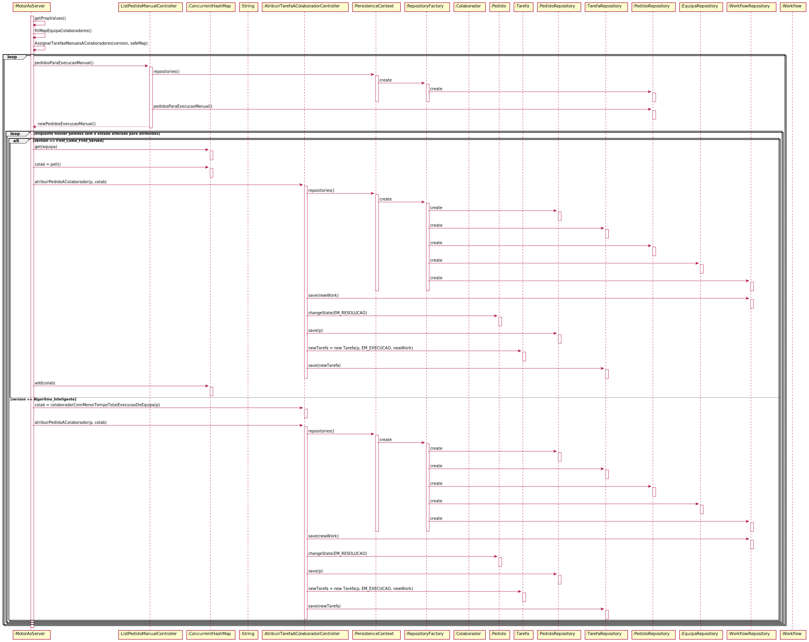

# US_4072
=======================================
# 1. Requisitos

**US_4072** Como Gestor de Projeto, eu pretendo que seja desenvolvido e integrado no Motor de Fluxos de Atividades algoritmos que assignem automáticamente tarefas a colaboradores de forma a evitar que essas tarefas tenham que ser reivindicadas pelos mesmos.

#### Requisitos funcionais

O sistema deve permitir que sejam executados um de dois algoritmos distintos, o primeiro é baseado em First Came First Served, vamo-nos focar novamente na informação dada pelo cliente para realizarmos esta US, "De forma a potenciar ao máximo o cumprimento dos níveis de serviço acordados, a atribuição automática deverá ocorrer imediatamente após o sistema detectar que existe uma tarefa para ser atribuída a alguém. No primeiro algoritmo, o caminho pode ser esse: o de atribuir a tarefa em mãos ao colaborador que satisfaça as condições requeridas para a tarefa (e.g. pertencer a uma dada equipa) e que esteja à mais tempo sem ter uma tarefa atribuida.", ou seja para este algoritmo temos de nos certificar que distribuimos equitativamente uma tarefa por cada colaborador da respetiva equipa da tarefa. No segundo temos em atenção para a equipa da tarefa, a quantidade de tarefas pendentes dos colaboradores e o tempo médio de execução de cada uma das tarefas atribuido dessa maneira a tarefa ao colaborador que tiver um tempo total médio de tarefas pendentes mais pequeno, indo de encontro com o que o cliente pede, " A ideia do segundo algoritmo é estimar a carga de trabalho de cada colaborador que possa satisfazer a tarefa em mãos e atribuir a tarefa aquele que estará em condições de a realizar mais cedo. Exemplo: o colaborador C1 tem 2 tarefas pendentes cujo tempo médio previsto de realização é de 10 minutos e 15 minutos respetivamente, perfazendo um total de 25 minutos enquanto o colaborador C2 tem apenas 1 tarefa pendente mas cujo tempo médio previsto de realização é 35 minutos. Perante este cenário a atribuição de uma nova tarefa realizável por C1 e C2 deverá recair em C1 visto que apesar de ter mais tarefas pendentes conseguirá previsivelmente conclui-las mais cedo do que C2 concluirá a sua tarefa.".

#### Regras de negócio

* A configuração do algoritmo a ser executado ocorre aquando da implantação (deployment) do mesmo, ou seja na configuração do ficheiro de propriedades da aplicação.

#### Pré-condições

* Existência no sistema de pedidos com resolução para equipas.

#### Pós-condições

* Os pedidos têm de ter o seu estado alterado.
* Tem de ser criada uma tarefa para o colaborador que o algoritmo escolheu.

#### Fluxo

Um colaborador solicita um serviço, este que tem resolução por uma equipa. O motor de fluxo de atividades que estará a ser executado nos servidores do putty acedendo constantemente a base de dados verificará que existe um novo pedido, encontrará todos os colaboradores pertencentes a equipa que podem solucionar/reivindicar o pedido. O algoritmo escolhido depois vai se encarregar de distribuir o pedido pelo melhor colaborador para que não haja uma sobrecarga de trabalhos. No final será criada uma tarefa para o colaborador escolhido e o estado do pedido é alterado tendo em conta que já foi reivindicado o pedido em causa.

## Design

Para a orientação da execução do caso de uso foi escolhida a realização de um diagrama de sequência face à facilidade de demonstração da interrelações entre as classes.

